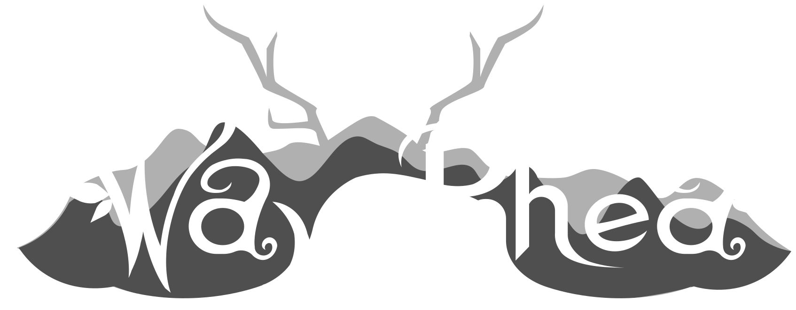

---
# You don't need to edit this file, it's empty on purpose.
# Edit theme's home layout instead if you wanna make some changes
# See: https://jekyllrb.com/docs/themes/#overriding-theme-defaults
layout: page
redirect_from:
  - /monsters-and-sprites
  - /way-of-rhea
description: Way of Rhea is an upcoming puzzle platformer that takes place in a world where you can only interact with objects that match your current color.
---

  
Anthropic Studios is an independent game company, currently working on Way of Rhea, a picturesque puzzle platformer that lets you correct your mistakes. Change your color. Teleport past the colored gates. Manipulate the color powered circuits. Befriend the color changing crabs—but don't let them out.
  

<iframe src="https://www.youtube.com/embed/eVrbZss_B3g" frameborder="0" allow="accelerometer; autoplay; encrypted-media; gyroscope; picture-in-picture" allowfullscreen></iframe>

    
    
    

<iframe src="https://store.steampowered.com/widget/1110620/?t=Wishlist%20Way%20of%20Rhea%20on%20Steam%20to%20be%20notified%20when%20it's%20released!" frameborder="0" width="100%" height="190"></iframe>

    

        

            
Official Selection

            
<b>Boston FIG</b>

            
2021

        

    

    

        

            
Official Selection

            
<b>PAX Rising</b>

            
<b>PAX East</b>

            
2020

        

    

    

        

            
Official Selection

            
<b>Play NYC</b>

            
2018-2020

        

    

    

        

            
Official Selection

            
<b>MIVS</b>

            
<b>MAGFest</b>

            
2020

        

    

    

        

            
Official Selection

            
<b>PIGSquad</b>

            
<b>PRGE</b>

            
2019

        

    

    

        

            
Official Selection

            
<b>MIVS</b>

            
<b>MAGWest</b>

            
2019

        

    



*Programming and game design by [Mason Remaley](https://twitter.com/masonremaley){:target="_blank"}, visual art by [Carolyn Whitmeyer](https://www.instagram.com/cw_visuals_insta/){:target="_blank"}, narrative design by [Evan Morris](https://twitter.com/evan_cmm){:target="_blank"}, sound by [Nick Romero](https://soundcloud.com/stonedape){:target="_blank"}, and music by [Colin Quinn](mailto:colinquinnwork@gmail.com).*
